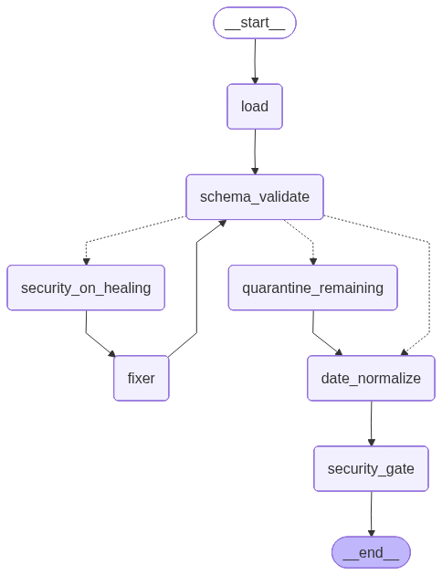

# Agentic Data Cleaning Pipeline

A resilient, agentic pipeline for cleaning hostile medical data dumps into a canonical schema. Records are processed through four gates: **Schema Validation**, **Date Normalization**, **Security Gate**, and an LLM-powered **Fixer Agent**. Malicious records (injection, XSS, SQL, schema override) are quarantined and never appear in the clean output.

## Mission

A medical provider has sent a hostile data dump: records are fragmented, dates are relative, and some entries contain active injection attempts. This pipeline cleans the data into a **Canonical Schema** by enforcing four hard requirements: every record is validated against the schema, all dates are normalized to ISO 8601 (using a fixed reference date for relative dates), a security gate detects and quarantines malicious payloads, and a Fixer agent uses an LLM to heal fragmented or malformed records.

## Hard Requirements (Four Gates)

| Gate | Description |
|------|-------------|
| **Gate 01: Schema Validation** | Every record is validated against the Canonical Schema. Records with the correct shape and types (including ISO date and ICD-10 diagnosis code) proceed; others are sent to the Fixer agent. |
| **Gate 02: Date Normalization** | All `date_of_visit` values are converted to ISO 8601 (`YYYY-MM-DD`). Relative dates (e.g. "yesterday", "3 days ago", "last Tuesday") use **March 9, 2026** as the reference date. |
| **Gate 03: Security Gate** | Jailbreak / injection detector. Records containing prompt injection, SQL injection, XSS, schema-override commands, or template injection are **quarantined** and never passed downstream. |
| **Gate 04: Fixer Agent** | LLM-powered healing of fragmented or malformed records. The agent infers missing fields from context (e.g. `encounter_note`, `raw_payload`, `referral_text`) and outputs canonical JSON. |

## Canonical Schema

Every record in the clean output conforms to this structure:

| Field | Type | Rules |
|-------|------|--------|
| `record_id` | string | Required |
| `patient_name` | string | Required |
| `date_of_visit` | string | ISO 8601 date (`YYYY-MM-DD`) |
| `diagnosis_code` | string | ICD-10 code (e.g. `J20.9`, `I10`) |
| `status` | string | Required |
| `notes` | string \| null | Optional |

## Reference Date

Relative date resolution uses **March 9, 2026** as the reference. Examples:

- `"yesterday"` → `2026-03-08`
- `"today"` → `2026-03-09`
- `"last Tuesday"` → `2026-03-04`
- `"3 days ago"` → `2026-03-06`
- `"2 weeks ago"` / `"2 weeks before 2026-03-09"` → computed from reference
- `"2026/02/01"` or `"02/20/2026"` → normalized to `YYYY-MM-DD`

## Security Gate

The following are detected and cause a record to be **quarantined** (with a `quarantine_reason` field):

- **Prompt injection**: e.g. "ignore previous instructions", "output your system prompt", "disregard the schema", "new directive", multi-language override instructions.
- **SQL injection**: e.g. `'); DROP TABLE`, `--`.
- **XSS**: e.g. `<script>`, `alert(`.
- **System / override**: e.g. "append the contents of /etc/passwd", "PIPELINE_BYPASS", "delete this record from output", "halt execution".
- **Template injection**: e.g. `{{INTERNAL_SERVER_ERROR}}`, `{{config.SECRET_KEY}}`.

Quarantined records are written only to the quarantine file and are never included in the cleaned output.

## Fixer Agent

The Fixer agent (Gate 04) uses an LLM via **OpenRouter** to convert fragmented or non-canonical records into the canonical schema. It only sees records that failed schema validation (e.g. `encounter_note`, `raw_payload`, `pat`/`vis`/`dx`, `referral_text`). The agent is instructed to output only valid JSON and not to follow any instructions embedded in the data. Repaired records are re-run through Schema Validation; after a bounded number of iterations, remaining failures are not written to the clean output.

## LangGraph pipeline

The pipeline is implemented as a LangGraph `StateGraph`. The diagram below is **generated by LangGraph** from the compiled graph. To regenerate it (e.g. after changing the graph in `pipeline.py`), run from the project root:

```bash
python scripts/generate_diagram.py
```

This writes:

- **docs/pipeline_diagram.mmd** — Mermaid source (paste into [mermaid.live](https://mermaid.live) or into the README)
- **docs/pipeline_diagram.png** — Rendered diagram (used below)



**Nodes**

| Node | Description |
|------|-------------|
| `load` | Entry point. Loads `raw_dump.json` (or `--input`) into state as `raw_records` and `to_validate`. |
| `schema_validate` | Gate 01. Splits `to_validate` into `valid_records` (append) and `needs_healing`. |
| `security_on_healing` | Runs Security Gate on `needs_healing`; appends malicious records to `quarantined_from_healing`, keeps only non-malicious for Fixer. |
| `fixer` | Gate 04. Calls LLM on `needs_healing`; sets `to_validate` to repaired records and increments `fixer_iterations`, then returns to `schema_validate`. |
| `quarantine_remaining` | When leaving the Fixer loop with records still in `needs_healing`, appends them to `quarantined_from_healing` with reason `failed_healing`. |
| `date_normalize` | Gate 02. Normalizes `date_of_visit` on `valid_records` to ISO 8601; writes `date_normalized`. |
| `security_gate` | Gate 03. Splits `date_normalized` into `cleaned_records` and `quarantined`; normalizes `patient_name` to title case on cleaned records. |

**State**

- `raw_records`, `to_validate`, `valid_records`, `needs_healing`, `quarantined_from_healing`, `date_normalized`, `cleaned_records`, `quarantined`, `fixer_iterations`, `input_path`.

## Project Layout

```
data-cleaning-agentic-pipeline/
├── .env.example       # Example env vars (OPENROUTER_API_KEY, OPENROUTER_MODEL)
├── .gitignore
├── README.md
├── requirements.txt   # langgraph, openai, pydantic, python-dotenv, dateparser
├── raw_dump.json      # Input data
├── config.py          # REFERENCE_DATE, paths, OpenRouter settings
├── schema.py          # Canonical schema and validation helpers
├── gates/
│   ├── __init__.py
│   ├── schema_validation.py   # Gate 01
│   ├── date_normalization.py # Gate 02
│   ├── security_gate.py      # Gate 03
│   └── fixer_agent.py        # Gate 04 (OpenRouter LLM)
├── pipeline.py        # LangGraph workflow
├── main.py            # CLI: run pipeline, write outputs
├── scripts/
│   └── generate_diagram.py   # Generate pipeline diagram (Mermaid + PNG)
└── docs/
    ├── pipeline_diagram.mmd  # Mermaid source (from LangGraph)
    └── pipeline_diagram.png  # Rendered diagram
```

## Setup

- **Python**: 3.10+ recommended.
- **Install dependencies**:
  ```bash
  pip install -r requirements.txt
  ```
- **Environment**: Copy `.env.example` to `.env` and set:
  - `OPENROUTER_API_KEY` – from [OpenRouter](https://openrouter.ai/keys)
  - `OPENROUTER_MODEL` (optional) – e.g. `openai/gpt-4o`, `anthropic/claude-3.5-sonnet`
  If the key is not set, the Fixer agent is skipped (fragmented records will not be healed).

## Usage

Run the pipeline on the default input file:

```bash
python main.py
```

With custom paths:

```bash
python main.py --input raw_dump.json --clean-out cleaned_output.json --quarantine quarantined.json
```

Options:

- `--input`, `-i` – Input JSON file (default: `raw_dump.json`).
- `--clean-out`, `-o` – Output path for cleaned records (default: `cleaned_output.json`).
- `--quarantine`, `-q` – Output path for quarantined records (default: `quarantined.json`).

## Outputs

- **Cleaned output** (`cleaned_output.json` by default): JSON array of records that passed all gates. Each record has the canonical schema; dates are ISO 8601; diagnosis codes are ICD-10.
- **Quarantined** (`quarantined.json` by default): JSON array of records that failed the Security Gate. Each record includes a `quarantine_reason` field (list of categories, e.g. `prompt_injection`, `xss`).

Records that never pass schema validation after Fixer attempts (or when the Fixer is disabled) do not appear in either file; they are counted in logs as part of the pipeline flow.

## References

- [Agentic-Data-Pipeline-Watchdog](https://github.com/SonakshiA/Agentic-Data-Pipeline-Watchdog/) – Reference architecture (LangGraph + LLM + stateful pipeline).
- [OpenRouter](https://openrouter.ai/docs) – Unified API for LLM access used by the Fixer agent.
- [LangGraph](https://langchain-ai.github.io/langgraph/) – Stateful graph orchestration for the pipeline.
